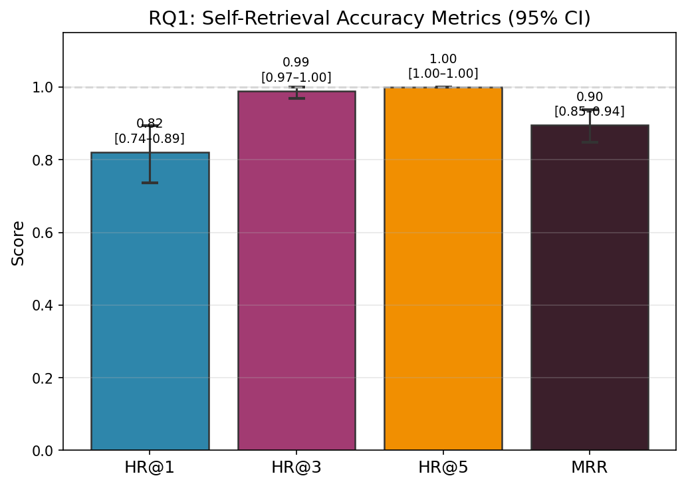
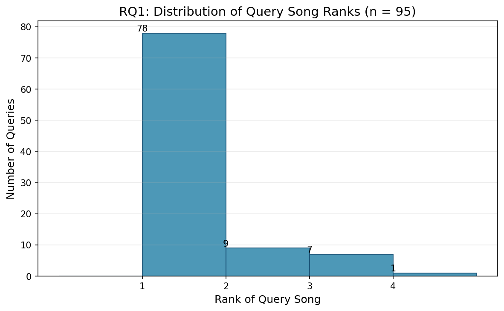
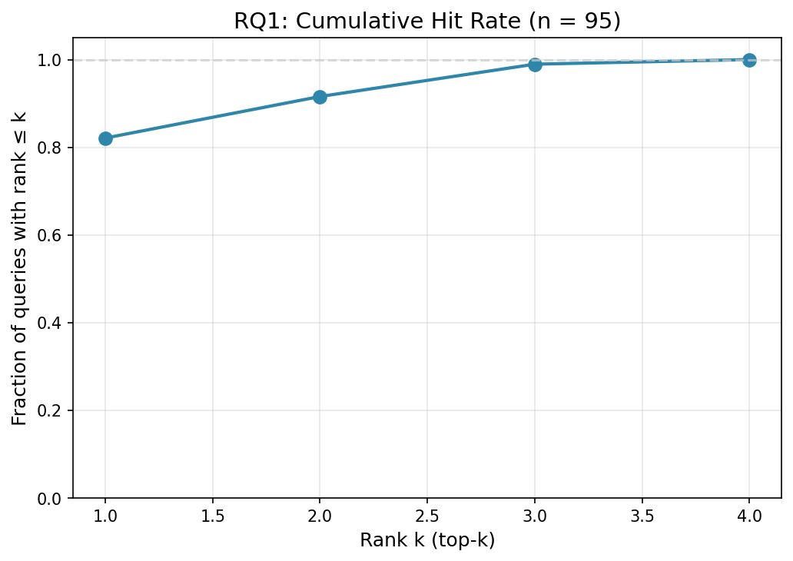
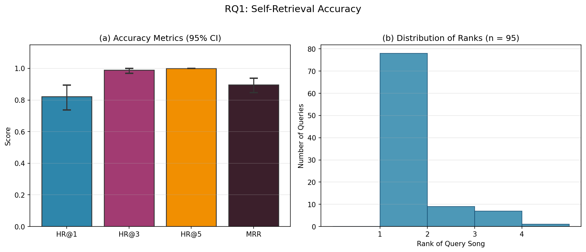

# Research Question 1: Self-Retrieval Accuracy

## Research Question

> When a synthetic user profile is derived from a single song's pitch-duration distribution — using that song's most-used pitches as favourites and least-used pitches as notes to avoid — does the recommendation system rank that same song at position 1, or within the top 3 or top 5?

## Motivation

A content-based recommender that scores songs by similarity to an ideal pitch profile should, at minimum, rank a song highly when the ideal is constructed directly from that song's own distribution. This *self-retrieval* test requires no human judgments: the query song is the only objectively correct answer, making it a standard offline evaluation for content-based systems when labelled relevance data is unavailable (Herlocker et al., 2004; Urbano et al., 2013).

## Methodology

### Data

The experiment uses the full song library stored in `data/tessituragrams.json`, containing **101 songs**. Each song's tessituragram maps MIDI pitch numbers to cumulative duration in quarter-note beats. Songs without valid pitch-range metadata are excluded, yielding **95 valid queries** (6 songs skipped).

### Synthetic Profile Derivation

For each query song *s*, a synthetic user profile is constructed as follows:

1. **Vocal range**: Set to the song's own pitch range, [min\_midi, max\_midi], ensuring *s* is never filtered out.
2. **Favourite notes**: The top 4 MIDI pitches by duration (L1-normalised proportion of singing time). If the song has fewer than 4 distinct pitches, all are used.
3. **Avoid notes**: The bottom 2 MIDI pitches by duration. If the song has fewer than 2 pitches, no avoids are set. Favourites and avoids are kept disjoint to prevent contradictory signals.

This profile is derived from the same L1-normalised pitch-duration representation that the scoring pipeline uses, ensuring internal coherence.

### Scoring Pipeline

For each query, the full recommendation pipeline is executed:

1. **Range filter**: Retain only songs whose entire pitch range falls within [min\_midi, max\_midi].
2. **Ideal vector construction**: Build a dense vector over the pitch space [min\_midi, ..., max\_midi], initialised to a base weight of 0.2, with a +1.0 boost at favourite positions and a −1.0 penalty at avoid positions (clamped to 0), then L2-normalised.
3. **Song scoring**: Each candidate song's tessituragram is converted to a dense vector over the same pitch space and L1-normalised. The final score is:

$$\text{final\_score} = \cos(\mathbf{s}, \mathbf{q}) - \alpha \sum_{i \in A} s_i$$

where **s** is the song's L1-normalised vector, **q** is the L2-normalised ideal vector, *A* is the set of avoid-note indices, and α = 0.5.

4. **Ranking**: Songs are sorted by final\_score descending, with ties broken alphabetically by filename.

### Metrics

Four rank-based metrics are computed across all *N* = 95 valid queries:

| Metric | Formula | Interpretation |
|--------|---------|----------------|
| HR@1 | (1/*N*) × \|{queries where rank = 1}\| | Fraction of times the query song was ranked first |
| HR@3 | (1/*N*) × \|{queries where rank ≤ 3}\| | Fraction of times the query song was in the top 3 |
| HR@5 | (1/*N*) × \|{queries where rank ≤ 5}\| | Fraction of times the query song was in the top 5 |
| MRR | (1/*N*) × Σ (1 / rank) | Mean Reciprocal Rank — rewards higher placements more |

### Confidence Intervals

95% confidence intervals are computed using the bootstrap percentile method (Efron & Tibshirani, 1993): 10,000 resamples of the query set with replacement, random seed 42 for reproducibility.

### Parameters

| Parameter | Value |
|-----------|-------|
| α (avoid penalty weight) | 0.5 |
| Top-*N* favourites | 4 |
| Bottom-*N* avoids | 2 |
| Bootstrap resamples | 10,000 |
| Random seed | 42 |
| Library size | 101 songs |
| Valid queries | 95 |

## Results

### Aggregate Metrics

| Metric | Value | 95% CI |
|--------|-------|--------|
| **HR@1** | 0.8211 | [0.7368, 0.8947] |
| **HR@3** | 0.9895 | [0.9684, 1.0000] |
| **HR@5** | 1.0000 | [1.0000, 1.0000] |
| **MRR** | 0.8956 | [0.8474, 0.9386] |

The system ranked the query song at position 1 in **82.1%** of cases (HR@1 = 0.8211). When the threshold is relaxed to the top 3, the hit rate rises to **98.9%** (HR@3 = 0.9895), and **every** query song appeared within the top 5 (HR@5 = 1.0000). The Mean Reciprocal Rank of **0.8956** indicates that, on average, the query song was ranked very close to position 1.

### Accuracy Metrics with 95% Confidence Intervals

*Figure 1. Bar chart of HR@1, HR@3, HR@5, and MRR with 95% bootstrap confidence intervals. The dashed line at 1.0 indicates perfect performance.*

### Distribution of Query Song Ranks

*Figure 2. Histogram showing how often the query song was ranked at each position. The majority of queries result in a rank of 1.*

### Cumulative Hit Rate

*Figure 3. Cumulative hit rate curve: the fraction of queries where the query song appeared at rank ≤ k, for k = 1, 2, ..., max. The curve reaches 1.0 by rank 5.*

### Combined Figure

*Figure 4. Combined view: (a) accuracy metrics with 95% CI; (b) distribution of query song ranks.*

## Interpretation

The results demonstrate strong self-retrieval accuracy. The system consistently identifies the query song as the top recommendation or places it very near the top. The 17.9% of cases where the query song was not ranked first (HR@1 < 1.0) occur when another song in the library has a sufficiently similar pitch distribution that, under the synthetic profile, it scores comparably or slightly higher. This is not a failure of the system — it reflects genuine similarity between songs in the corpus. The fact that HR@5 = 1.0 confirms that the query song is never buried deep in the ranking.

The narrow confidence intervals (e.g., HR@1 CI width of ~0.16) reflect the moderate query set size (*N* = 95). All intervals are well above chance level, providing strong evidence that the scoring and ranking pipeline is internally consistent.

## Limitations

- The synthetic profile is derived from the same representation used for scoring, which creates a favourable evaluation setting. This experiment tests internal consistency, not external validity with real users.
- Six songs were excluded because their filtered candidate sets contained fewer than 2 songs, limiting the generalisability to songs with very narrow or very wide ranges.
- The library of 101 songs, while sufficient for stable estimates, is modest in size. Larger corpora would produce tighter confidence intervals.

## References

- Herlocker, J. L., Konstan, J. A., Terveen, L. G., & Riedl, J. T. (2004). Evaluating collaborative filtering recommender systems. *ACM Transactions on Information Systems*, 22(1), 5–53.
- Urbano, J., Schedl, M., & Serra, X. (2013). Evaluation in music information retrieval. *Journal of Intelligent Information Systems*, 41(2), 345–369.
- Efron, B., & Tibshirani, R. J. (1993). *An Introduction to the Bootstrap*. Chapman & Hall.
