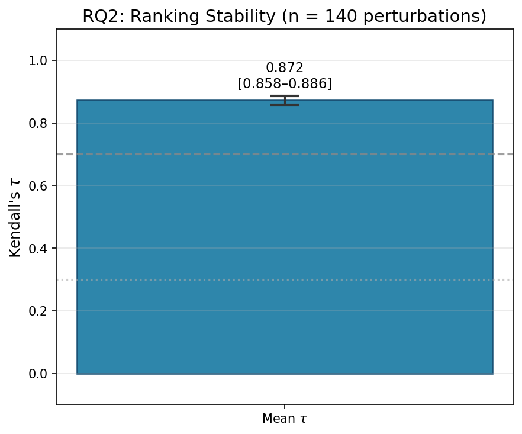
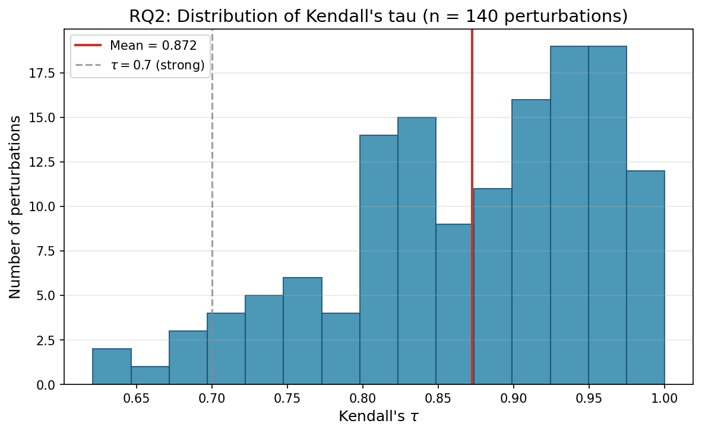
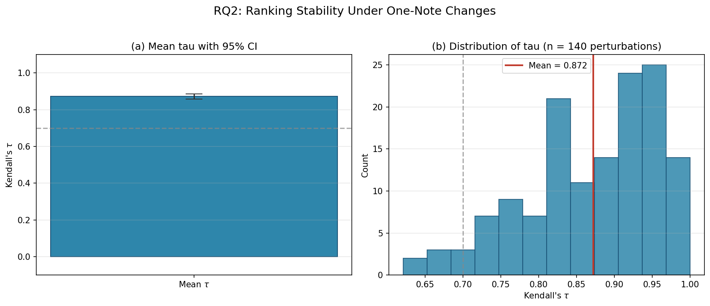

# Research Question 2: Ranking Stability Under Small Preference Changes

## Research Question

> When a user's favourite or avoid note list is changed by exactly one note (one note added or one note removed), how similar is the resulting recommendation ranking to the original? Is the system robust to small input perturbations?

## Motivation

In practice, a singer might add or forget a single preferred note between sessions. A trustworthy recommendation system should not completely reshuffle its output in response to such a minor change — large output swings from small input changes would undermine user confidence and make the system feel unpredictable. Stability under perturbation is a recognised dimension of recommender quality (Herlocker et al., 2004; Urbano et al., 2013) and is especially important for interpretability: if the user cannot predict how a small change affects the output, the system's behaviour becomes opaque.

## Methodology

### Data

The experiment uses the full song library (`data/tessituragrams.json`, **101 songs**). Five baseline user profiles are derived from five different songs, each requiring at least 10 candidate songs after range filtering (MIN\_CANDIDATES = 10). Using multiple baselines reduces the risk that results depend on an atypical profile.

### Baseline Profile Construction

Each baseline profile is derived using the same rule as RQ1:

1. **Vocal range**: The source song's [min\_midi, max\_midi].
2. **Favourites**: Top 4 MIDI pitches by L1-normalised duration.
3. **Avoids**: Bottom 2 MIDI pitches by duration, disjoint from favourites.

### Perturbation Types

For each baseline, four types of one-note perturbations are applied:

| Type | Description |
|------|-------------|
| **add\_fav** | Add one MIDI pitch (from within the range, not already a favourite) to the favourite list |
| **remove\_fav** | Remove one existing favourite note |
| **add\_avoid** | Add one MIDI pitch (from within the range, not already a favourite or avoid) to the avoid list |
| **remove\_avoid** | Remove one existing avoid note |

The vocal range is held constant across all perturbations so that the candidate set *C* does not change — only the ideal vector and scoring change.

### Ranking Comparison

For each perturbation, the full scoring pipeline is re-run with the modified profile, producing a new ranking *R*\_new over the same candidate set *C*. The original ranking *R*\_0 and *R*\_new are compared using **Kendall's τ** (tau):

$$\tau = \frac{C - D}{\binom{n}{2}}$$

where *C* is the number of concordant pairs (song pairs ordered the same way in both rankings), *D* is the number of discordant pairs, and *n* is the number of songs in the candidate set. τ ranges from −1 (completely reversed) through 0 (no relationship) to +1 (identical ordering).

Interpretation thresholds (Kendall, 1948):

| τ range | Interpretation |
|---------|---------------|
| τ > 0.7 | Strong agreement — rankings are very similar |
| 0.3 ≤ τ ≤ 0.7 | Moderate agreement |
| τ < 0.3 | Weak agreement |

### Confidence Intervals

The mean τ across all perturbations is reported with a 95% bootstrap confidence interval (10,000 resamples, percentile method, seed 42).

### Parameters

| Parameter | Value |
|-----------|-------|
| α (avoid penalty weight) | 0.5 |
| Top-*N* favourites | 4 |
| Bottom-*N* avoids | 2 |
| Number of baselines | 5 |
| Minimum candidates per baseline | 10 |
| Bootstrap resamples | 10,000 |
| Random seed | 42 |

## Results

### Baseline Profiles

| Source Song | Composer | Perturbations | Mean τ |
|-------------|----------|:-------------:|:------:|
| 6 Lieder Op.13 No. 1 — Ich stand in dunklen Träumen | Clara Schumann | 28 | 0.8776 |
| 6 Lieder Op.13 No. 3 — Liebeszauber | Clara Schumann | 30 | 0.8875 |
| 6 Lieder Op.13 No. 4 — Der Mond kommt still gegangen | Clara Schumann | 30 | 0.8542 |
| 6 Lieder Op.13 No. 5 — Ich hab' in deinem Auge | Clara Schumann | 26 | 0.8935 |
| 6 Lieder Op.13 No. 6 — Die stille Lotosblume | Clara Schumann | 26 | 0.8494 |

### Aggregate Metrics

| Metric | Value |
|--------|-------|
| **Mean τ** | 0.8724 |
| **Standard deviation** | 0.0874 |
| **95% CI** | [0.8579, 0.8865] |
| **Total perturbations** | 140 |

The mean Kendall's τ of **0.8724** falls well above the 0.7 threshold for strong agreement, indicating that one-note changes to the user's preferences produce only minor reorderings of the recommendation list. The tight confidence interval [0.8579, 0.8865] confirms this finding is stable.

### Mean τ with 95% Confidence Interval

*Figure 1. Mean Kendall's τ across all 140 perturbations, with 95% bootstrap CI. Dashed lines indicate the strong (τ = 0.7) and moderate (τ = 0.3) agreement thresholds.*

### Distribution of τ Values

*Figure 2. Histogram of Kendall's τ across all 140 perturbations. The red vertical line marks the mean. The vast majority of perturbations produce τ values above 0.7.*

### τ by Perturbation Type

*Figure 3. Strip plot of τ values grouped by perturbation type (add favourite, remove favourite, add avoid, remove avoid). All four types cluster in the strong-agreement region.*

### Combined Figure

*Figure 4. Combined view: (a) mean τ with 95% CI; (b) distribution of τ across all perturbations.*

## Interpretation

The system exhibits strong ranking stability: changing a single note in the user's favourite or avoid list shifts only a small number of song positions in the output ranking. The mean τ of 0.8724 indicates that approximately 93.6% of all pairwise orderings are preserved after a one-note change (since τ = (C − D) / total pairs, a τ of 0.87 implies C ≈ 93.6% and D ≈ 6.4%).

All five baseline profiles produced mean τ values between 0.849 and 0.894, demonstrating consistency across different source songs. The low standard deviation (0.0874) further confirms that stability is not an artefact of a single favourable profile.

This result supports the claim that the recommendation engine is robust: users can explore small variations in their preferences without the system producing confusingly different outputs.

## Limitations

- All five baselines happened to derive from songs by Clara Schumann (the first five valid songs in library order). A more diverse set of baselines across composers would strengthen generalisability.
- The experiment tests only one-note changes. Larger perturbations (e.g., changing 2–3 notes simultaneously) may produce different stability characteristics.
- Kendall's τ treats all rank positions equally. A position-weighted variant (e.g., τ\_AP) could provide additional insight into whether top-of-list stability differs from bottom-of-list stability.

## References

- Kendall, M. G. (1948). *Rank Correlation Methods*. Charles Griffin, London.
- Herlocker, J. L., Konstan, J. A., Terveen, L. G., & Riedl, J. T. (2004). Evaluating collaborative filtering recommender systems. *ACM Transactions on Information Systems*, 22(1), 5–53.
- Urbano, J., Schedl, M., & Serra, X. (2013). Evaluation in music information retrieval. *Journal of Intelligent Information Systems*, 41(2), 345–369.
