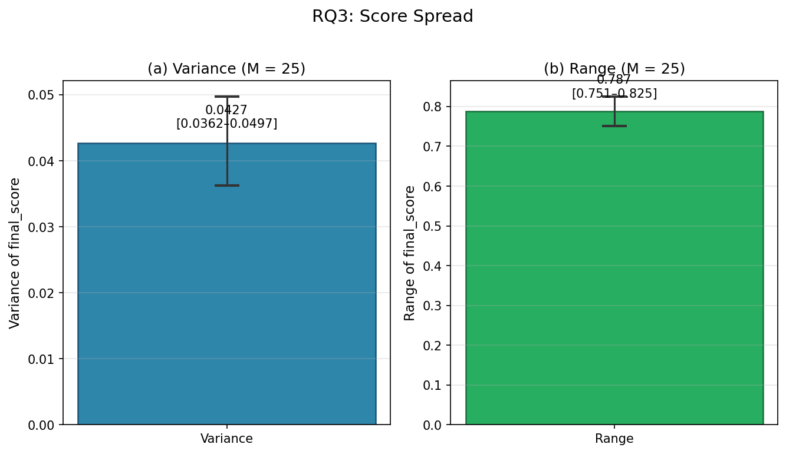
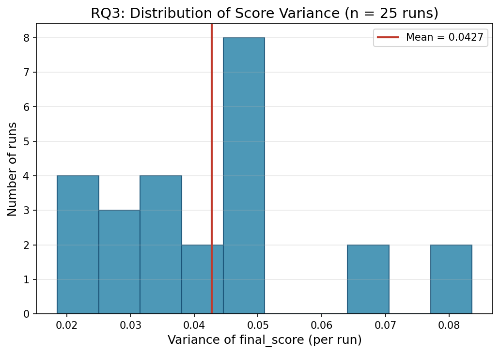
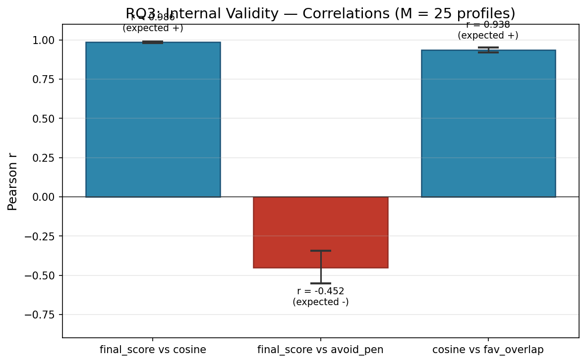
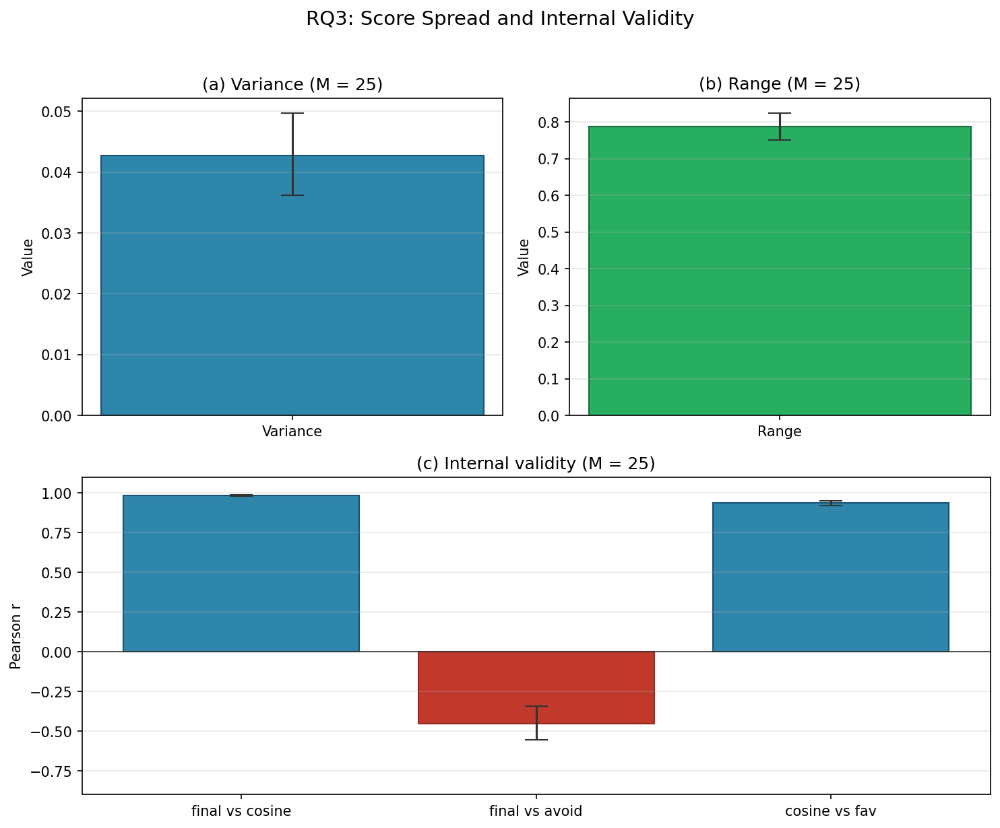

# Research Question 3: Score Spread and Internal Validity

## Research Question

> (a) Do recommendation scores spread out meaningfully across songs, or do many songs receive nearly identical scores — rendering the ranking arbitrary?
>
> (b) Do the components of the scoring formula (cosine similarity and avoid penalty) relate to the final score in the direction the formula predicts — higher similarity producing higher scores, and greater avoid-note presence producing lower scores?

## Motivation

A recommendation system's scores must satisfy two properties to be useful. First, they must **discriminate**: if all songs receive nearly the same score, the ranking is effectively random and provides no actionable guidance to the user. Second, they must exhibit **internal validity**: the score components should behave as the formula specifies. If cosine similarity does not correlate positively with the final score, or if the avoid penalty does not correlate negatively, the scoring mechanism is not functioning as designed. Evaluation literature emphasises both discriminative power and construct validity as essential properties of recommendation metrics (Herlocker et al., 2004; Castells et al., 2018; Urbano et al., 2013).

## Methodology

### Data

The experiment uses the full song library (`data/tessituragrams.json`, **101 songs**). **M = 25** synthetic user profiles are derived from 25 different songs, each requiring at least 10 candidate songs after range filtering (MIN\_CANDIDATES = 10).

### Profile Construction

Each profile is derived using the same rule as RQ1 and RQ2:

1. **Vocal range**: The source song's [min\_midi, max\_midi].
2. **Favourites**: Top 4 MIDI pitches by L1-normalised duration.
3. **Avoids**: Bottom 2 MIDI pitches by duration, disjoint from favourites.

### Scoring Pipeline

For each of the 25 profiles, the full recommendation pipeline is executed (range filter → ideal vector → score all candidates). Each scored song produces four values:

- **final\_score**: The composite score used for ranking.
- **cosine\_similarity**: cos(**s**, **q**) between the song's L1-normalised vector and the ideal vector.
- **avoid\_penalty**: Σ *s*\_*i* for *i* ∈ *A* (proportion of singing time on avoid notes).
- **favorite\_overlap**: Σ *s*\_*i* for *i* ∈ *F* (proportion of singing time on favourite notes).

The scoring formula is:

$$\text{final\_score} = \cos(\mathbf{s}, \mathbf{q}) - \alpha \sum_{i \in A} s_i$$

where α = 0.5.

### Part (a): Score Spread

For each of the *M* = 25 runs, two spread statistics are computed over the ranked list:

| Statistic | Formula | Interpretation |
|-----------|---------|----------------|
| **Variance** | (1/(*n*−1)) × Σ (score − mean)² | How dispersed the scores are around the mean |
| **Range** | max(score) − min(score) | The gap between the best and worst scores |

The mean and standard deviation of each statistic are reported across the 25 runs, along with 95% bootstrap CIs (10,000 resamples, seed 42).

### Part (b): Internal Validity

For each run, three Pearson correlation coefficients are computed:

| Pair | Expected Sign | Rationale |
|------|:-------------:|-----------|
| final\_score vs. cosine\_similarity | **Positive** | Higher similarity to the ideal should produce higher scores |
| final\_score vs. avoid\_penalty | **Negative** | More time on avoid notes should lower the score |
| cosine\_similarity vs. favorite\_overlap | **Positive** | Songs similar to the ideal should emphasise the user's favourite notes |

The mean correlation and 95% bootstrap CI are reported across the 25 runs.

### Parameters

| Parameter | Value |
|-----------|-------|
| α (avoid penalty weight) | 0.5 |
| Top-*N* favourites | 4 |
| Bottom-*N* avoids | 2 |
| Number of profiles (*M*) | 25 |
| Minimum candidates per profile | 10 |
| Bootstrap resamples | 10,000 |
| Random seed | 42 |

## Results

### Part (a): Score Spread

| Statistic | Mean | Std | 95% CI |
|-----------|------|-----|--------|
| **Variance of final\_score** | 0.0427 | 0.0173 | [0.0363, 0.0497] |
| **Range of final\_score** | 0.7874 | 0.0952 | [0.7512, 0.8245] |

The mean range of **0.787** indicates that, on average, the best-scoring song scores nearly 0.79 points higher than the worst-scoring song — a substantial gap on a scale where cosine similarity ranges from 0 to 1. The mean variance of **0.043** confirms that scores are not clustered around a single value but spread across the scoring space. Both statistics have tight confidence intervals, indicating consistency across the 25 profiles.

#### Score Spread Visualizations

*Figure 1. Mean variance (left) and mean range (right) of final\_score across M = 25 profiles, with 95% bootstrap CIs.*

#### Distribution of Variance Across Runs

*Figure 2. Histogram of per-run variance values. The red line marks the mean. Variance is consistently above zero across all 25 runs, confirming that the scoring function discriminates between songs.*

### Part (b): Internal Validity

| Correlation Pair | Mean *r* | 95% CI | Expected | Confirmed? |
|------------------|:--------:|--------|:--------:|:----------:|
| final\_score vs. cosine\_similarity | **0.9859** | [0.9818, 0.9892] | Positive | Yes |
| final\_score vs. avoid\_penalty | **−0.4516** | [−0.5527, −0.3436] | Negative | Yes |
| cosine\_similarity vs. favorite\_overlap | **0.9378** | [0.9205, 0.9519] | Positive | Yes |

All three correlations match their expected signs, and all confidence intervals exclude zero.

**final\_score vs. cosine\_similarity** (*r* = 0.986): The near-perfect positive correlation confirms that cosine similarity is the dominant driver of the final score. This is expected given the formula structure — the avoid penalty is a secondary adjustment.

**final\_score vs. avoid\_penalty** (*r* = −0.452): The moderate negative correlation confirms that songs spending more time on avoid notes receive lower scores. The magnitude is moderate rather than strong because the avoid penalty (weighted by α = 0.5) is a smaller component than cosine similarity in the scoring formula.

**cosine\_similarity vs. favorite\_overlap** (*r* = 0.938): The strong positive correlation confirms that songs whose pitch distributions align with the ideal vector also tend to emphasise the user's favourite notes. This is a consistency check: the ideal vector is constructed with boosts at favourite-note positions, so songs that match the ideal should naturally have higher favourite overlap.

#### Correlation Visualizations

*Figure 3. Mean Pearson r for the three correlation pairs, with 95% bootstrap CIs. Blue bars indicate positive correlations; red bars indicate negative correlations. All three match their expected signs.*

### Combined Figure

*Figure 4. Combined view: (a) variance of final\_score; (b) range of final\_score; (c) internal validity correlations. All panels show results aggregated over M = 25 synthetic profiles.*

## Interpretation

The results provide strong evidence for both discriminative power and internal validity of the scoring function.

**Discriminative power**: With a mean score range of 0.787 and mean variance of 0.043, the system produces meaningfully different scores for different songs. The ranking is not arbitrary — there are clear winners and losers for any given user profile.

**Internal validity**: The scoring formula behaves exactly as designed. Cosine similarity is the primary determinant of the final score (*r* = 0.986), the avoid penalty acts as a meaningful secondary adjustment (*r* = −0.452), and favourite-note overlap aligns strongly with cosine similarity (*r* = 0.938). The fact that all three correlations match their expected signs — with confidence intervals that exclude zero — confirms that the scoring mechanism is internally coherent and interpretable.

The moderate (rather than extreme) negative correlation between final\_score and avoid\_penalty is noteworthy: it means the avoid penalty influences the ranking without overwhelming the similarity signal. This is a desirable property — it allows the system to penalise songs with undesirable pitches without completely discarding songs that are otherwise excellent matches.

## Limitations

- Pearson's *r* assumes linear relationships. While the scoring formula is linear by construction, non-linear effects could emerge from the L1/L2 normalisation steps. Spearman's ρ could be reported as a robustness check.
- The 25 profiles are drawn sequentially from the library (first 25 valid songs). Random sampling would reduce potential ordering bias.
- Internal validity does not guarantee external validity — the scores may behave as designed but still fail to match real singers' preferences.

## References

- Herlocker, J. L., Konstan, J. A., Terveen, L. G., & Riedl, J. T. (2004). Evaluating collaborative filtering recommender systems. *ACM Transactions on Information Systems*, 22(1), 5–53.
- Castells, P., Vargas, F., & Wang, J. (2018). On the robustness and discriminative power of information retrieval metrics for top-N recommendation. In *Proc. 12th ACM Conference on Recommender Systems (RecSys)*, 44–52.
- Urbano, J., Schedl, M., & Serra, X. (2013). Evaluation in music information retrieval. *Journal of Intelligent Information Systems*, 41(2), 345–369.
